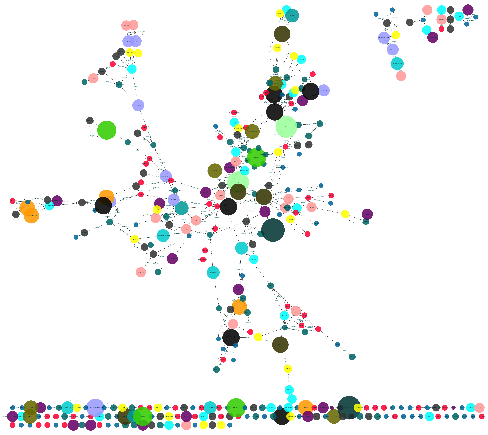
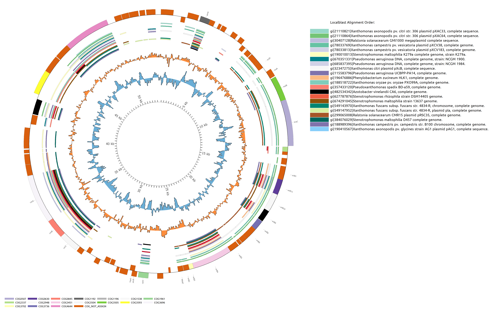
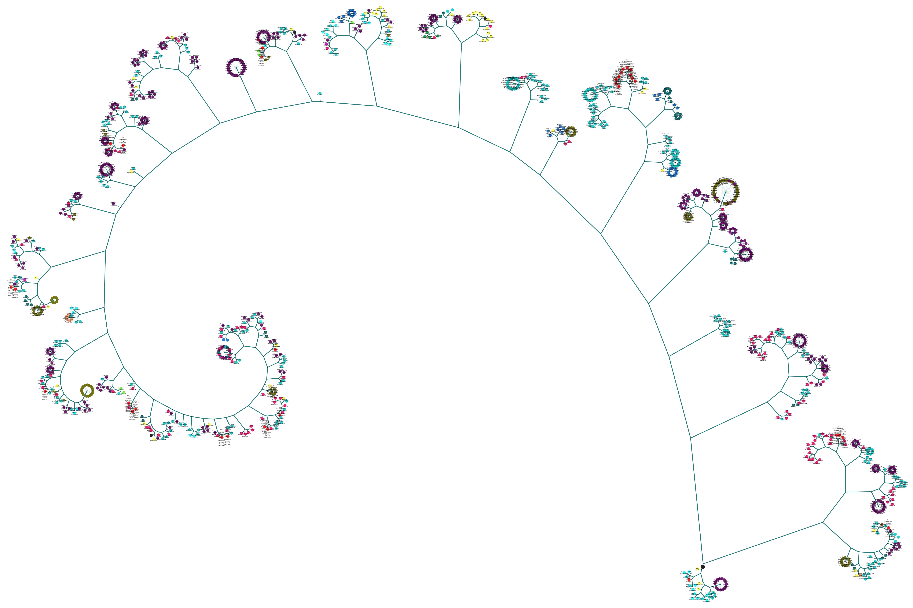

###### [WARNING] This project is a work in progress and is not recommended for production use.

# GCModeller
GCModeller: genomics CAD(Computer Assistant Design) Modeller system in .NET language

> + HOME: http://gcmodeller.org
> + Github: https://github.com/smrucc/GCModeller
> + SDK docs: http://docs.gcmodeller.org

**Supported platform:** ``Microsoft Windows``, ``GNU Linux``, ``MAC``  
**Development:** Microsoft VisualStudio 2015 | VisualBasic.NET 
**Runtime environment:** [VisualBasic App](https://www.nuget.org/packages/VB_AppFramework/) v1.0.40 &amp; ``.NET Framework 4.6`` (or ``mono 4.4``) 
**Installation:** ``VS2015`` is required of compiles this project. After the source code have been download, just open solution file **[/src/GCModeller.sln](./src/GCModeller.sln)**, and when restore nuget packages finished, then you are good to go of compile GCModeller project.

---------------------------------------------------------------------------------------------------

``GCModeller`` is an open source cloud computing platform for the geneticist and systems biology. You can easily build a local computing server cluster for ``GCModeller`` on the large amount biological data analysis.

The ``GCModeller`` platform is original writen in ``VisualBasic.NET`` language, a feature bioinformatics analysis environment that .NET language hybrids programming with R language was included, which its SDK is available at repository:
https://github.com/SMRUCC/R.Bioinformatics

Currently the ``R`` language hybrids programming environment just provides some ``bioconductor`` API for the analysis in ``GCModeller``.

``GCModeller`` is a set of utility tools working on the annotation of the whole cell system, this including the whole genome regulation annotation, transcriptome analysis toolkits, metabolism pathway analysis toolkits. And some common bioinformatics problem utils tools and common biological database I/O tools is also available in GCModeller for the .NET language programming.

### Directory Roadmap
+ [/GCModeller](./GCModeller) : The location of GCModeller compile output, I have config all of the project output in the path ``./GCModeller/bin/``
+ [/src](./src)
	+ [/src/GCModeller](./src/GCModeller) : GCModeller basic library and analysis protocols
	+ [/src/interops](./src/interops) : GCModeller tools that dependent on the external programs
	+ [/src/R.Bioconductor](./src/R.Bioconductor) : R language hybrids environment
	+ [/src/repository](./src/repository) : GCModeller data repository system
	+ [/src/runtime](./src/runtime) : Third part library and VisualBasic runtime source code
+ [/tools](./tools)

### Data Standards
+ GCModeller supports the ``SBML`` and ``BIOM`` data standards for exchanges the analysis and model data with other bioinformatics softwares.
+ Supports ``PSI`` data for the biological interaction network model
+ Supports ``OBO`` data for ontology database like ``go``.

   

### Publications

Here listing the scientific paperworks that based on the analysis services of GCModeller:

+ _Niu, X.-N., et al. (2015)._ **"Complete sequence and detailed analysis of the first indigenous plasmid from Xanthomonas oryzae pv. oryzicola."** BMC Microbiol 15(1): 1-15.

    + **DOI:** 10.1186/s12866-015-0562-x

> Bacterial plasmids have a major impact on metabolic function and adaptation of their hosts. An indigenous plasmid was identified in a Chinese isolate (GX01) of the invasive phytopathogen Xanthomonas oryzae pv. oryzicola (Xoc), the causal agent of rice bacterial leaf streak (BLS). To elucidate the biological functions of the plasmid, we have sequenced and comprehensively annotated the plasmid.

### Gallery

### Feature tools

*  1. NCBI localblast utility
*  2. MEME tools combine with Regprecise database
*  3. Circos plots utility
*  4. Protein structure analysis tools
*  5. KEGG database tools
*  6. Reactome/MetaCyc database tools
*  7. Venn diagram drawing tools
*  8. Cytoscape utility tools
*  9. Motif Parallel alignment tools for the protein interaction network and family annotation

**The main virtual cell analysis engine is under development progress.**

Visit our project home: http://gcmodeller.org

## For developers
Here are some released library of the ``GCModeller`` is published on nuget, then you can install these library in ``VisualStudio`` from **Package Manager Console**:

Install Microsoft VisualBasic Runtime environment library for GCModeller:
https://github.com/xieguigang/VisualBasic_AppFramework
>PM>  Install-Package VB_AppFramework

The GCModeller core base library was released:
https://github.com/SMRUCC/GCModeller.Core
>PM>  Install-Package GCModeller.Core

The NCBI localblast analysis toolkit:
https://github.com/SMRUCC/ncbi-localblast
>PM>  Install-Package NCBI_localblast

----------------------------------------------------------------------------------------------------
 

Copyleft &copy; [SMRUCC genomics](http://smrucc.org) 2016. All rights reversed.
