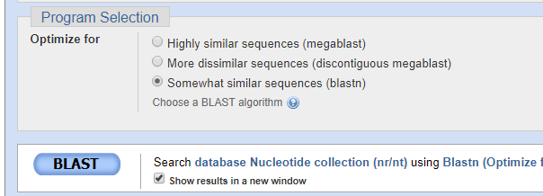
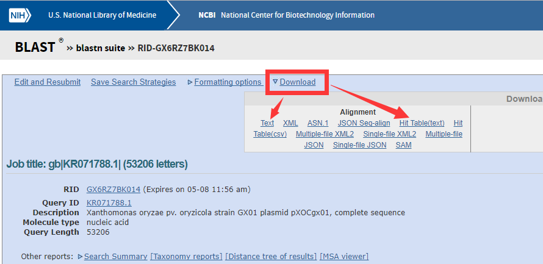
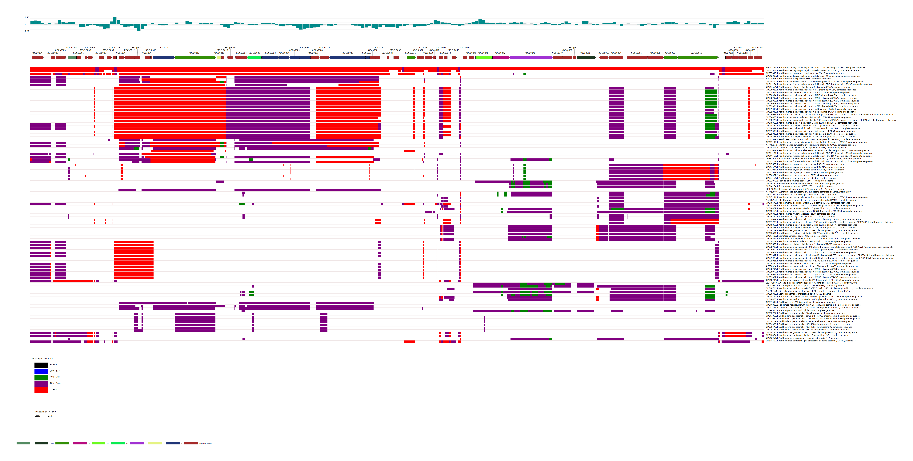

# Blastn MapPlot using GCModeller

## CommandLine Help

Typing this command in your commandline console, and then the GCModeller **MapPlot** tool will output such commandline help information:

```python
mapplot ? /Visualize.blastn.alignment

#  Help for command '/Visualize.blastn.alignment':
#
#  Information:  Blastn result alignment visualization from the NCBI web blast. This tools is only works for
#                a plasmid blastn search result or a small gene cluster region in a large genome.
#  Usage:        MapPlot /Visualize.blastn.alignment /in <alignmentTable.txt> /genbank <genome.gb> [/ORF.catagory <catagory.tsv> /local /out <image.png>]
#  Example:      CLI usage example not found!
#
#  Arguments:
#  ============================
#
#   /genbank         Description:  Provides the target genome coordinates for the blastn map plots.
#
#                    Example:      /genbank <term_string>
#
#   /local           Description:  The file for ``/in`` parameter is a local blastn output result
#                                  file?
#
#                    Example:      /local <term_string>
#
#   /ORF.catagory    Description:  Using for the ORF shape color render, in a text file and each
#                                  line its text format like: ``geneID``<TAB>``COG/KOG/GO/KO``
#
#                    Example:      /ORF.catagory <term_string>
```

This map plot commandline have 2 required parameters:

+ ``/in`` parameter for input the blastn alignment result, it can be a alignmentTable file from the NCBI web blast output, or a local blastn output, its meaning based on the optional parameter ``/local`` is presented or not.
+ ``/genbank`` parameter provides the genome coordinate information for the alignment hits and gene map plot.

And it also takes 3 optional parameter:

+ ``/ORF.catagory`` for the color profiling of the gene map plot, its format is in a keyvalue pair form like
  ```
  geneID<TAB><categoryID>
  geneID<TAB><categoryID>
  geneID<TAB><categoryID>
  geneID<TAB><categoryID>
  ...
  ```
  Where the geneID is the ``locus_tag`` value in the gene section from your genbank input file, example like:
  ```
  gene            2709..3347
                  /gene="parA"
                  /locus_tag="XOCp0004"
  ```
  and then the corresponding geneID value in this category file is:
  ```
  XOCp0004	D	COG1192
  ```
  Please note that the white blank between the ``geneID`` and ``COG category`` is a **&lt;TAB>** character, not a **&lt;SPACE>** character, you can edit this category file in Excel and then save as the **tsv** file.
  **If this parameter is ignored not presented in the commandline, then all of your gene objects in the gene map plot will be white color filled.**
+ ``/out`` is the output image file path, output image in ``png`` format or svg(if the graphics_driver is set to svg by using ``/@set`` argument) Compatible format.
+ ``/local``, as we previously mentioned, this parameter defined the input data type of the parameter ``/in``.

## Demo

First of all, for plotting the gene map chart, we should have a genbank file for your genome, download from NCBI or generated it by yourself if your genome have not been published yet.


> Choose the blastn mode then you can have more details visualize information result for the blastn alignment.

Then for plots visualize the blastn alignments, we must provides the alignment table file or local blastn output file.

+ For a alignmentTable file, just goto NCBI blast website, and using the blastn function, download the result from the 5th result(**Hit Table(text)**), example as:
  
+ For a local blastn output, you can choose the first download format(**Text**) as we just show above. Or using the standard blast+ localblast:
  ```bash
  makeblastdb -in "fastafile" -dbtype nucl
  blastn -query "query.fasta" -db "database.fasta" -out "local-blastn.txt"
  ```

If you want add the colors on your gene map plot, then you should specifc the ``/ORF.category`` parameter, the ORF category can be COG, KOG, KO, GO, etc... anything you want.
And here I using the COG category as the demo example:

##### Generate COG annotation using myva COG tool in GCModeller

You can using GCModeller localblast tool for generates the COG annotation by using myva database.

First of all, you should provides your proteins fasta sequence, and then invoke a standard blastp search, example like:

```bash
makeblastdb -in myva -dbtype prot
blastp -query "./pXOCgx01.fasta" -db "myva" -evalue 1e-5 -out "./pXOCgx01-myva.txt"
```

and then you can using GCModeller localblast tool to generates the COG annotation based on the myva database search result:

```bash
localblast /COG.myva /blastp "./pXOCgx01-myva.txt" /whog "whog.XML" /simple /out "./pXOCgx01-myva.myva_COG.txt"
```

##### Blastn MapPlot

Here is a example for plots the blastn alignment result in commandline:

```bash
MapPlot /Visualize.blastn.alignment /in "./blastn.txt" /genbank "./pXOCgx01.txt" /ORF.catagory "./pXOCgx01-myva.myva_COG.txt" /local
```



You can found two demo in this folder:

+ ``./demo/`` for plasmid small genome blastn visualize. Genbank data can be download from: 
  > https://www.ncbi.nlm.nih.gov/nuccore/KR071788
+ ``./cluster_demo/`` for visualize a gene cluster in a large genome. Genbank data can be download from: 
  > https://www.ncbi.nlm.nih.gov/nuccore/CP000050.1
