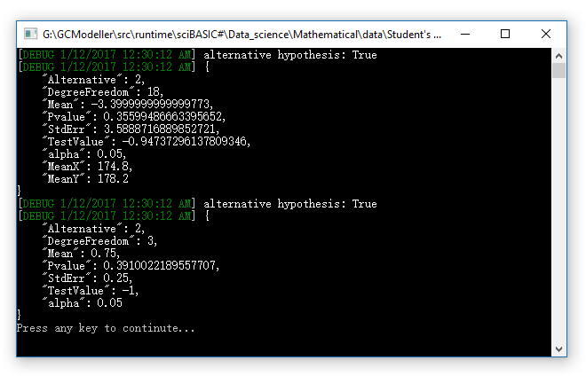

# Student’s t-test


## The R language example

###### One sample

```R
v = c(0, 1, 1, 1)

t.test(v, mu=1)

#         One Sample t-test
#
# data:  v
# t = -1, df = 3, p-value = 0.391
# alternative hypothesis: true mean is not equal to 1
# 95 percent confidence interval:
#  -0.04561158  1.54561158
# sample estimates:
# mean of x
#      0.75
```

###### Two sample

```R
a = c(175, 168, 168, 190, 156, 181, 182, 175, 174, 179)
b = c(185, 169, 173, 173, 188, 186, 175, 174, 179, 180)

t.test(a,b, var.equal=TRUE, paired=FALSE)

#        Two Sample t-test
#
# data:  a and b
# t = -0.94737, df = 18, p-value = 0.356
# alternative hypothesis: true difference in means is not equal to 0
# 95 percent confidence interval:
#  -10.93994   4.13994
# sample estimates:
# mean of x mean of y
#     174.8     178.2
```


## Implements the Student's T-test step by step


## Demo

