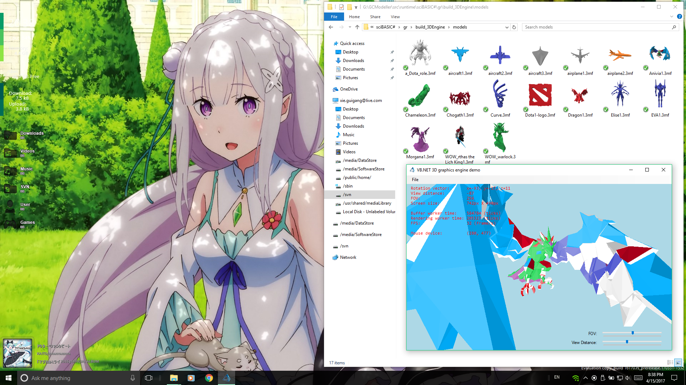
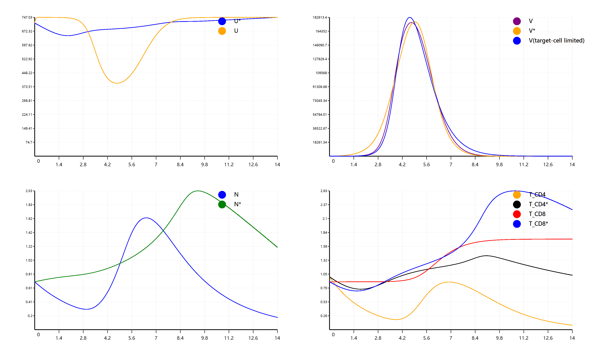
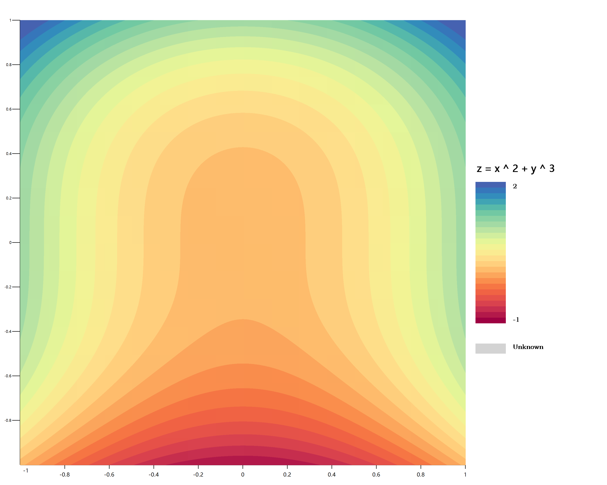
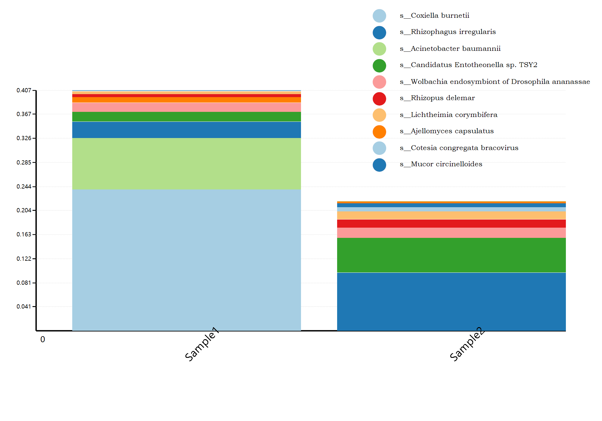
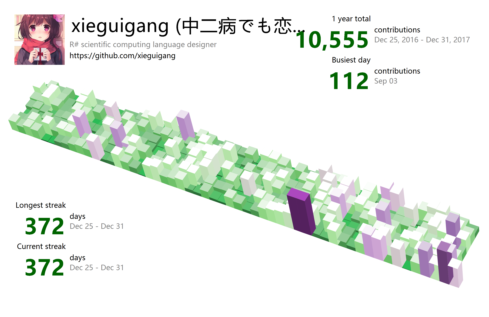

# sciBASIC#: Microsoft VisualBasic for Scientific Computing


[]()
[](https://opensource.org/licenses/GPL-3.0/)
[](https://doi.org/10.5281/zenodo.166002)

###### [WARNING] This project is a work in progress and is not recommended for production use.
> Probably some namespace and object name may changes frequently on each commit, and you are feel free to using the **Object Browser** in visual studio to adapted to the object not defined problem which was caused by these changes.....

<hr>

+ 
+ 

## Scientific Computing runtime for VisualBasic.NET

``sciBASIC#``(read as scientific visualbasic or just ``sciBASIC sharp``) is a Microsoft VisualBasic language feature runtime for your data science application which is running in the CLI environment on Windows/Linux/macOS **Desktop/Server** platform or **supercomputer** platform. This framework project includes a lot of mathematics utility tools and the utility code extension functions for the data sciences programming in VisualBasic language, and extends the VisualBasic programming language syntax. Makes the VisualBasic programming style more modernized in the data science industry by using this runtime library framework.

> Abount VisualBasic code style guidelines:
> + https://github.com/xieguigang/sciBASIC/tree/master/docs/vb_codestyle

> Guides for using this framework, you can found the document and content index at the [README.md](./guides/README.md)(This guidelines document is currently compiling for users):
> + https://github.com/xieguigang/sciBASIC/tree/master/docs/guides

<hr/>

### Runtime Installation

+ Compile &amp; Application Development on this runtime required the latest VisualStudio 2017.
+ If you are running sciBASIC runtime on Windows, please makesure your operating system supports .NET framework 4.6
+ If you are running sciBASIC runtime on Linux/macOS, please install mono runtime at first by following the installation manual on **mono-project** website. And then the ``Microsoft VisualBasic core runtime`` is required, you can find this runtime file in this repository: [Microsoft.VisualBasic.7z](./Microsoft.VisualBasic.7z), just extract this 7z archive and put the **Microsoft.VisualBasic.dll** kernel in the application directory.

### Install this framework via nuget package

For .NET Framework 4.6:

+ https://www.nuget.org/packages/sciBASIC#

```bash
# For install latest stable release version:
PM> Install-Package sciBASIC
# For install latest unstable beta version:
PM> Install-Package sciBASIC -Pre
```

### Directory Structure

###### 1. source projects

+ **[/CLI_tools](./CLI_tools/)** : Some small utilities and example tools
+ **[/Data](./Data/)** : *sciBASIC#* data framework system for data science, includes data frame, data I/O and data object search framework.
+ **[/Data_science](./Data_science/)** : *sciBASIC#* Mathmatica system, data graphics plot system & Data Mining library
+ **[/Microsoft.VisualBasic.Architecture.Framework](./Microsoft.VisualBasic.Architecture.Framework/)** : Microsoft VisualBasic General App Runtime core
+ **[/mime](./mime/)** : various mime-type doc parsers in VisualBasic
+ **[/gr](./gr/)** : **sciBASIC# Artists**: (graphic artist) VB.NET data graphics system
+ **[/www](./www/)** : Web related utilities code

###### 2. docs for User

+ **[/guides](./docs/guides/)** : This framework code usage example and manual documents
+ **[/vb_codestyle](./docs/vb_codestyle/)** : sciBASIC# Coding style standard document

---------------------------------------------------------------------------------------------------------------

## Namespace

|Namespace                      |Description                                                                       |
|-------------------------------|----------------------------------------------------------------------------------|
|Microsoft.VisualBasic.Data     |Raw data processing related code                                                  |
|Microsoft.VisualBasic.Imaging  |``sciBASIC`` graphics system based on the GDI+ API from ``System.Drawing``        |
|Microsoft.VisualBasic.Math     |``sciBASIC`` math library                                                         |
|Microsoft.VisualBasic.Scripting|String expression related API for CLI programming and optional parameter scripting|

## ODEs scripting language feature

Example for solving a dynamics system using VisualBasic ODEs scripting language feature, demo created for the [Lorenz system](https://en.wikipedia.org/wiki/Lorenz_system):

```vbnet
Dim x, y, z As var
Dim sigma# = 10
Dim rho# = 28
Dim beta# = 8 / 3
Dim t = (a:=0, b:=120, dt:=0.005)

Call Let$(list:=Function() {x = 1, y = 1, z = 1})
Call {
    x = Function() sigma * (y - x),
    y = Function() x * (rho - z) - y,
    z = Function() x * y - beta * z
}.Solve(dt:=t) _
 .DataFrame _
 .Save($"{App.HOME}/Lorenz_system.csv")
```


## Microsoft VisualBasic Trinity Natural Language Processor

###### TextRank

PageRank analysis on the text paragraph for find out the keyword, here is the pagerank result of the this example paragraph:

> "the important pagerank. show on pagerank. have significance pagerank. implements pagerank algorithm. textrank base on pagerank."


## Image fast binarization using VisualBasic image extension API
[``Sub Binarization(ByRef curBitmap As Bitmap, Optional style As BinarizationStyles = BinarizationStyles.Binary)``](./Microsoft.VisualBasic.Architecture.Framework/Extensions/Image/Bitmap/hcBitmap.vb)

```vbnet
Imports Microsoft.VisualBasic.Imaging

Dim bitmap As Image = Image.FromFile("./etc/lena/f13e6388b975d9434ad9e1a41272d242_1_orig.jpg")

Call bitmap.Grayscale().SaveAs("./etc/lena/lena.grayscale.png", ImageFormats.Png)
Call bitmap.GetBinaryBitmap
     .SaveAs("./etc/lena/lena.binary.png", ImageFormats.Png)
Call bitmap.GetBinaryBitmap(BinarizationStyles.SparseGray)
     .SaveAs("./etc/lena/lena.gray.png", ImageFormats.Png)
```

|Normal|Binary|SparseGray|Grayscale|
|------|------|----|---------|
|||||

## sciBASIC# Graphics Artist

[](https://github.com/SMRUCC/GCModeller/blob/master/src/GCModeller/models/Networks/STRING/FunctionalEnrichmentPlot.vb)

+ **[Network Visualization Interface](./gr/Datavisualization.Network/)**
+ **[2D Imaging & 3D graphics engine](./gr/Microsoft.VisualBasic.Imaging/)**
+ **[Isometric 3D graphics engine](./gr/Microsoft.VisualBasic.Imaging/Drawing3D/Models/README.md)**

 


## Microsoft VisualBasic Data Science & Data Plots System

+ **[Mathematics & Chart Ploting System](./Data_science/Mathematical/)**
+ **[Darwinism computing module](./Data_science/Darwinism/)**
+ **[Data Mining &amp; Machine Learning](./Data_science/)**
+ **[sciBASIC# DataFrame System](./Data/DataFrame/)**

##### sciBASIC# Chart Plots System

```vbnet
Imports Microsoft.VisualBasic.Data.ChartPlots
```



[](./Data_science/Mathematica/Plots/BarPlot/AlignmentPlot.vb)

###### 3D heatmap

```vbnet
Dim func As Func(Of Double, Double, (Z#, Color#)) =
_
    Function(x, y) (3 * Math.Sin(x) * Math.Cos(y), Color:=x + y ^ 2)

Call Plot3D.ScatterHeatmap.Plot(
    func, "-3,3", "-3,3",
    New Camera With {
        .screen = New Size(3600, 2500),
        .ViewDistance = -3.3,
        .angleZ = 30,
        .angleX = 30,
        .angleY = -30,
        .offset = New Point(-100, -100)
    }) _
    .SaveAs("./3d-heatmap.png")
```


###### Scatter Heatmap

You can using a lambda expression as the plot data source:

```vbnet
Dim f As Func(Of Double, Double, Double) =
    Function(x, y) x ^ 2 + y ^ 3

Call ScatterHeatmap _
    .Plot(f, "(-1,1)", "(-1,1)", legendTitle:="z = x ^ 2 + y ^ 3") _
    .SaveAs("./scatter-heatmap.png")
```




###### Stacked Barplot

The stacked barplot is a best choice for visualize the sample composition and compares to other samples data:

```vbnet
Imports Microsoft.VisualBasic.Data.ChartPlots

' Plots metagenome taxonomy profiles annotation result using barplot
Dim taxonomy As BarDataGroup = csv.LoadBarData(
    "./FigurePlot-Reference-Unigenes.absolute.level1.csv",
    "Paired:c8") ' Using color brewer color profiles

Call BarPlot.Plot(
    taxonomy,
    New Size(2000, 1400),
    stacked:=True,
    legendFont:=New Font(FontFace.BookmanOldStyle, 18)) _
    .SaveAs("./FigurePlot-Reference-Unigenes.absolute.level1.png")
```



###### beta-PDF

```vbnet
Public Function beta(x#, alpha#, _beta#) As Double
    Return Pow(x, alpha - 1) * Pow((1 - x), _beta - 1) *
        Exp(lgamma(alpha + _beta) - lgamma(alpha) - lgamma(_beta))
End Function

Public Function lgamma(x As Double) As Double
    Dim logterm As Double = Math.Log(x * (1.0F + x) * (2.0F + x))
    Dim xp3 As Double = 3.0F + x

    Return -2.081061F - x + 0.0833333F / xp3 -
        logterm + (2.5F + x) * Math.Log(xp3)
End Function
```
</img>
> https://en.wikipedia.org/wiki/Beta_distribution

###### Heatmap


```vbnet
Dim data = DataSet.LoadDataSet("./Quick_correlation_matrix_heatmap/mtcars.csv")

Call data.CorrelatesNormalized() _
    .Plot(mapName:="Jet",  ' Using internal color theme 'Jet'
          mapLevels:=20,
          legendFont:=New Font(FontFace.BookmanOldStyle, 32)) _
    .SaveAs("./images/heatmap.png")
```

> ###### Microsoft.VisualBasic.Mathematical.Plots.Heatmap::Plot(IEnumerable(Of NamedValue(Of Dictionary(Of String, Double))), Color(), Integer, String, Boolean, Size, Size, String, String, String) As Bitmap

Heatmap data source from R dataset [``mtcars``](./Data_science/Mathematica/Quick_correlation_matrix_heatmap/mtcars.csv) and calculates [the Pearson correlations](./Microsoft.VisualBasic.Architecture.Framework/Extensions/Math/Correlations.vb):

```R
data(mtcars)
write.csv(mtcars, "./Data_science/Mathematical/Quick_correlation_matrix_heatmap/mtcars.csv")
```

<hr/>

## New VisualBasic Language Syntax in this runtime

First of all, imports the language feature namespace of VisualBasic

```vbnet
#Region "Microsoft VisualBasic.NET language"
' sciBASIC# general application runtime
' Microsoft.VisualBasic.Architecture.Framework_v3.0_22.0.76.201__8da45dcd8060cc9a.dll
#End Region

Imports Microsoft.VisualBasic.Language
```

###### 1. Inline value assign

Old:

```vbnet
Dim s As String = ""

Do While Not s Is Nothing
   s = blablabla

   ' Do other staff
Loop
```

New:

```vbnet
Dim s As New Value(Of String)

Do While Not (s = blablabla) Is Nothing
   ' Do other staff
Loop
```

###### 2. List(Of ) Add

Old:

```vbnet
Dim l As New List(Of String)

Call l.Add("123")
Call l.AddRange(From x In 100.Sequence Select CStr(x))
```

New:

```vbnet
Dim l As New List(Of String)

l += "123"
l += From x As Integer
     In 100.Sequence
     Select CStr(x)
```

###### New Integer(int) type in visualbasic

+ value ranges syntax

```vbnet
Dim min As int = 1
Dim max As int = 200
Dim x% = 199

' Compares
Call println(min <= x < max) ' True
x += 10 ' 209
Call println(min <= x < max) ' False
x = -1
Call println(min <= x < max) ' False
```

+ inline calculation and value assign

```vbnet
Dim bitChunk As Byte() = New Byte(INT64 - 1) {}
Dim p As int = Scan0

Call Array.ConstrainedCopy(rawStream, ++(p + INT64), bitChunk, Scan0, INT64)
ProtocolCategory = BitConverter.ToInt64(bitChunk, Scan0)

Call Array.ConstrainedCopy(rawStream, ++(p + INT64), bitChunk, Scan0, INT64)
Protocol = BitConverter.ToInt64(bitChunk, Scan0)

bitChunk = New Byte(INT64 - 1) {}
Call Array.ConstrainedCopy(rawStream, p = (p + INT64), bitChunk, Scan0, INT64)
BufferLength = BitConverter.ToInt64(bitChunk, Scan0)
```

<hr/>



> Copyleft ! 2017, [I@xieguigang.me](mailto://I@xieguigang.me) (http://scibasic.cool/)
