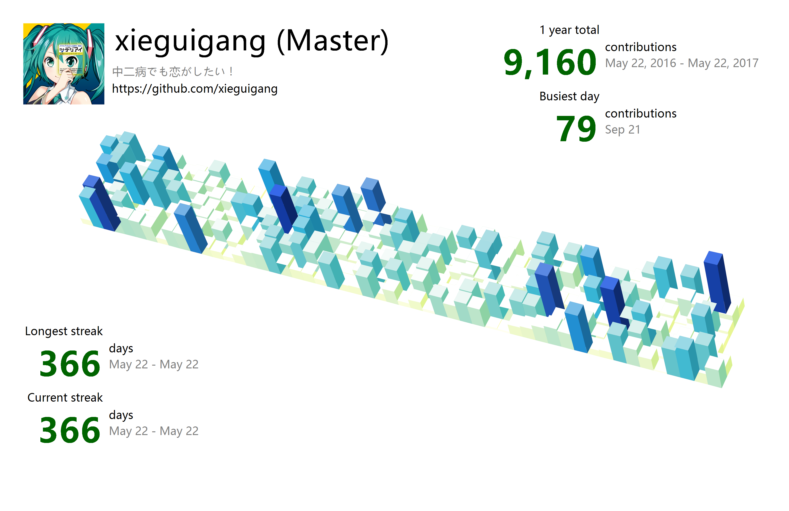

VisualBasic Graphics Artiest Project
> https://github.com/xieguigang/sciBASIC/tree/master/gr

#### Download user github contributions

We can using a simple http ``GET`` method for download the github user contribtion data, due to the reason of the user contribution data is returned in a ``svg`` graphics document, so that we can parsing the return data by using XML method in ``VisualBasic``:

```vbnet
Dim url$ = $"https://github.com/users/{userName}/contributions"

Dim svg$ = url.GET
Dim xml As New XmlDocument

Call xml.LoadXml("<?xml version=""1.0"" encoding=""utf-8""?>" & vbCrLf & svg)
```

The user github contribution for each day is stored in a rect svg element, with a xml attribute named ``data-count`` for the contribution counts in each day and using a xml attribute named ``data-date`` for the day identified:

```xml
<rect class="day" width="10" height="10" x="13" y="12" fill="#7bc96f" data-count="22" data-date="2016-05-23"/>
```

And these rect data can be read from path: ``svg -> g -> g -> rect``:

```xml
<svg width="676" height="104" class="js-calendar-graph-svg">
  <g transform="translate(16, 20)">
      <g transform="translate(0, 0)">
          <rect class="day" ... data-count="9" data-date="2016-05-22"/>
          <rect class="day" ... data-count="22" data-date="2016-05-23"/>
          <rect class="day" ... data-count="30" data-date="2016-05-24"/>
          <rect class="day" ... data-count="15" data-date="2016-05-25"/>
          <rect class="day" ... data-count="17" data-date="2016-05-26"/>
          <rect class="day" ... data-count="54" data-date="2016-05-27"/>
          <rect class="day" ... data-count="40" data-date="2016-05-28"/>
      </g>
      ...
```

So that we can parsing the returned svg XML by using the code:

```vbnet
Dim g As XmlNodeList = xml _
    .SelectSingleNode("svg") _
    .SelectSingleNode("g") _
    .SelectNodes("g")
Dim contributions As New Dictionary(Of Date, Integer)

For Each week As XmlNode In g
    Dim days = week.SelectNodes("rect")

    For Each day As XmlNode In days
        Dim date$ = day.Attributes.GetNamedItem("data-date").InnerText
        Dim count = day.Attributes.GetNamedItem("data-count").InnerText
        contributions(DateTime.Parse([date])) = CInt(count)
    Next
Next
```


### Github contribution data analysis

##### Streak

A streak on github contribution is define as the day range **without** ``ZERO`` contribution day. So that we can simple split the date ordered contribution result by condition expression: ``day.Value = 0``, here is how and in a very easy way:

```vbnet
Dim streak = contributions.Split(Function(day) day.Value = 0, )
```

So that the longest streak can be calculation by the splited block elements count descending ordering:

```vbnet
Dim LongestStreak = streak _
    .OrderByDescending(Function(days) days.Length) _
    .First
```

And the current streak is the nearest block, the last block is the nearest:

```vbnet
Dim currentStreak = streak.Last
```

##### Contributions

When we add all of the contribution values in the result, then we get all of the contribution values:

```vbnet
Dim total$ = contributions _
    .Sum(Function(day) day.Value) _
    .ToString("N") _
    .Replace(".00", "")
```

The busiest day is the day that have the max contribution counts, just simply Descending ordering the day contribution count:

```vbnet
Dim busiestDay = contributions _
    .OrderByDescending(Function(day) day.Value) _
    .FirstOrDefault
```

For getting the one year range, then we can ordering the date value and then the first and last element in the result sequence is what we want:

```vbnet
Dim oneYear$

With contributions _
    .Keys _
    .OrderBy(Function(day) day) _
    .ToArray

    oneYear = $"{ .First.ToString("MMM dd, yyyy")} - { .Last.ToString("MMM dd, yyyy")}"
End With
```


#### Isometric 3D graphing

```vbnet
' Imports Microsoft.VisualBasic.Imaging.Drawing3D

Dim camera As New Camera With {
    .screen = region.Size,
    .fov = 10000,
    .ViewDistance = -85,
    .angleX = 30,
    .angleY = 30,
    .angleZ = 120
}
```

###### The height

We should mapping the contribution count in each day as the Z height in the 3D graphic:

```
z = (current / Max) * maxZ
```

##### Using the VisualBasic internal Color Designer

```vbnet
' Imports Microsoft.VisualBasic.Imaging.Drawing2D.Colors

Dim colors As List(Of Color) = Designer.GetColors(schema, max).AsList

' The first color is the color for No github contribution
Call colors.Insert(Scan0, noColor.TranslateColor)
```

We can creates the github contributions 3D Isometric graphics model by uisng the ``VisualBasic`` internal 3D API:

```vbnet
' Imports Microsoft.VisualBasic.Imaging.Drawing3D
' Imports Microsoft.VisualBasic.Imaging.Drawing3D.Math3D
' Imports Microsoft.VisualBasic.Imaging.Drawing3D.Models.Isometric.Shapes

Dim view As New IsometricView
Dim weeks = contributions.Split(7)
Dim x!, y!

For Each week In weeks
    For Each day As KeyValuePair(Of Date, Integer) In week
        Dim height! = day.Value / max * maxZ
        Dim o As New Point3D(x, y, 0)
        Dim model3D As New Prism(o, rectWidth, rectWidth, height)

        x += rectWidth

        Call view.Add(model3D, colors(day.Value))
    Next

    x = 0
    y += rectWidth
Next
```

By creates the box object for each day's contribution value, we just simply using the ``Prism`` 3D model.
And then we can convert the ``Prism`` 3D model in the Isometric engine into the 3D surface model with a simple Linq method:

```vbnet
Dim model As Surface() = view.ToArray
model = model _
    .Centra _
    .Offsets(model) _
    .ToArray

' Rotate the 3D model to our view window
model = camera.Rotate(model).ToArray
```

At last drawing 3D model and output onto a graphics canvas:

```vbnet
Call DirectCast(g, Graphics2D) _
    .Graphics _
    .SurfacePainter(camera, model)
```

