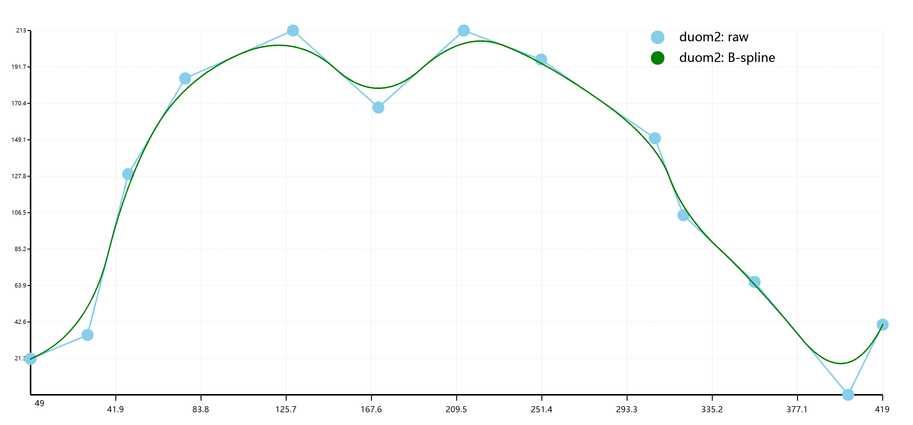
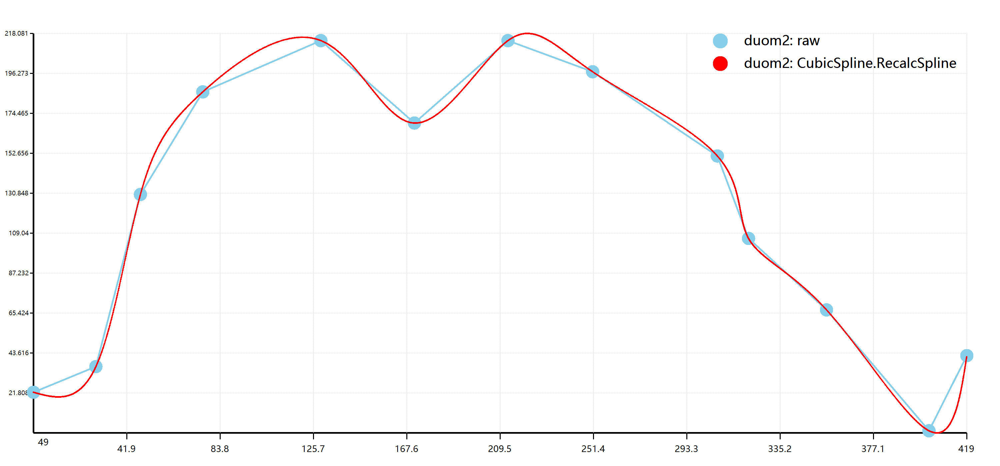
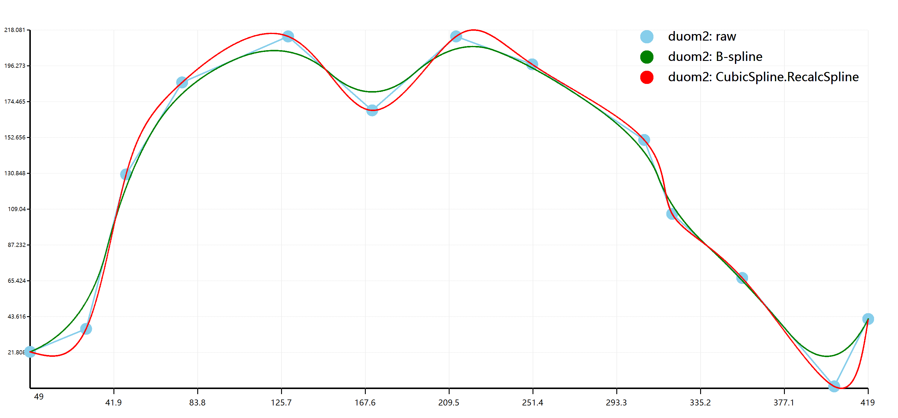

# [Curve Interpolation Tools](../../Math/Spline)

```vbnet
Imports Microsoft.VisualBasic.Mathematical.Interpolation
```

##### Data used in this README

Testing data from this file: [duom2.txt](./duom2.txt)

```vbnet
Dim data#()() = "./duom2.txt" _
    .IterateAllLines _
    .ToArray(Function(s) Regex.Replace(s, "\s+", " ") _
        .Trim _
        .Split _
        .ToArray(AddressOf Val))
Dim points As PointF() = data _
    .ToArray(Function(c) New PointF With {
        .X = c(Scan0),
        .Y = c(1)
    })
Dim raw = points.FromPoints(
    lineColor:="skyblue",
    ptSize:=40,
    title:="duom2: raw")
```

## B-spline
In the mathematical subfield of numerical analysis, a B-spline, or basis spline, is a spline function that has minimal support with respect to a given degree, smoothness, and domain partition. Any spline function of given degree can be expressed as a linear combination of B-splines of that degree. Cardinal B-splines have knots that are equidistant from each other. B-splines can be used for curve-fitting and numerical differentiation of experimental data.

In the computer-aided design and computer graphics, spline functions are constructed as linear combinations of B-splines with a set of control points.

> This tools source code was translated from the original work of @kerrot : [B_Spline](https://github.com/kerrot/B_Spline)

#### How to use

```vbnet
Dim result = B_Spline.Compute(points, degree, RESOLUTION:=100)
```

###### Example

```vbnet
result = B_Spline.Compute(points,, RESOLUTION:=100)

Dim B_interplot = result.FromPoints(
    lineColor:="green",
    ptSize:=15,
    title:="duom2: B-spline",
    lineType:=DashStyle.Dash,
    lineWidth:=3)

Call Scatter.Plot({raw, B_interplot}, size:=New Size(3000, 1400)) _
    .SaveAs("./duom2-B-spline.png")
```



## CubicSpline
A simple VB.NET tool demonstrating the use of cubic spline interpolation. This tool was adapted from the original work of @CrushedPixel : [CubicSplineDemo](https://github.com/CrushedPixel/CubicSplineDemo)

#### How to use
Too simple!

```vbnet
Imports Microsoft.VisualBasic.Mathematical

Dim data As Point() ' = ...
Dim result = CubicSpline.RecalcSpline(data).ToArray
```

###### Example

```vbnet
Dim result = CubicSpline.RecalcSpline(points).ToArray

Dim interplot = result.FromPoints(
    lineColor:="red",
    ptSize:=15,
    title:="duom2: CubicSpline.RecalcSpline",
    lineType:=DashStyle.Dash,
    lineWidth:=3)

Call Scatter.Plot({raw, interplot}) _
    .SaveAs("./duom2-cubic-spline.png")
```



## Method Compare

```vbnet
Call Scatter.Plot({raw, B_interplot, interplot}, size:=New Size(3000, 1400)) _
    .SaveAs("./duom2-compares.png")
```

